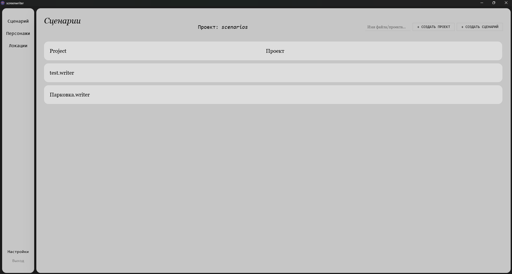
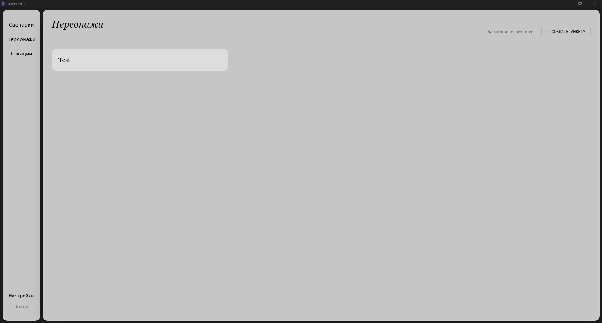
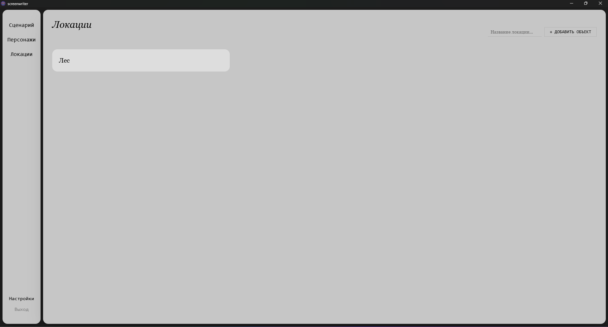

# Screenwriter - WIP

>   **Обратите внимание:** Название проекта является рабочим и может измениться в процессе разработки.

Автоматизированное рабочее место для сценаристов. Веб-приложение закрывает ряд проблем сценаристов, чтобы люди могли писать восхитительные тексты, не задумываясь о стилизации.

## Интерфейс приложения

Экран "Сценарии" и процесс написания

### Список сценариев

<!-- ### Процесс написания сценария
 -->

Экран "Персонажи" и карточки героев

### Список персонажей

<!-- ### Написание персонажей
 -->

Экран "Локации"

### Список локаций

<!-- ### Написания локаций
 -->

## Features

- Панель управления для быстрой стилизации сценария 
- Drag-and-drop метод для внесения персонажей и локации в сценарий
- Подсказки персонажей и локации, чтобы не забыть характеристику

## Технологический стек

Проект разработан на современном, легковесном и производительном стеке, благодаря чему приложение работает молниеносно, потребляет минимум оперативной памяти и собирается в компактный исполняемый файл `.exe`.

- **Runtime-окружение:** [Tauri](https://tauri.app) (сборка легковесных десктопных приложений на Rust)
- **Язык логики (Backend):** [Rust](https://rust-lang.org) (безопасность памяти и высокая скорость работы)
- **Фреймворк (Frontend):** [SvelteKit](https://svelte.dev) + [TypeScript](https://typescriptlang.org)
- **Инструмент сборки фронтенда:** [Vite](https://vite.dev) (сверхбыстрая горячая перезагрузка и бандлинг)
- **Стилизация интерфейса:** [Tailwind CSS](https://tailwindcss.com)

## Запуск программы

Для работы с приложением вам не нужно ничего устанавливать. Достаточно скачать готовый исполняемый файл:

1. Перейдите в раздел **[Releases](https://github.com/CyberPochita/Screenwriter/releases/tag/v1.0.1-alpha)** на GitHub.
2. Скачайте последнюю версию архива (например, `Screenwriter_v1.0.zip`).
3. Распакуйте архив в удобное место.
4. Запустите файл `Screenwriter.exe`.

## Системные требования

- **Операционная система:** Windows 10 / 11 (64-bit)
- **Свободное место на диске:** ~100 МБ
- **Интернет:** Не требуется (приложение работает полностью локально)
    
##  Баги и предложения

Если вы нашли ошибку, у вас зависла программа или есть крутая идея для новой фичи:
1. Перейдите во вкладку **[Issues](https://github.com/CyberPochita/Screenwriter/issues)**.
2. Нажмите кнопку **New issue**.
3. Подробно опишите проблему и, если возможно, прикрепите скриншот.

Также вы можете написать мне на почту grusha-as@yandex.ru

## Лицензия

Этот проект является открытым исходным кодом (Open Source) и распространяется под лицензией **MIT**. 

Полный текст лицензии с указанием авторских прав можно найти в файле [LICENSE](LICENSE).

